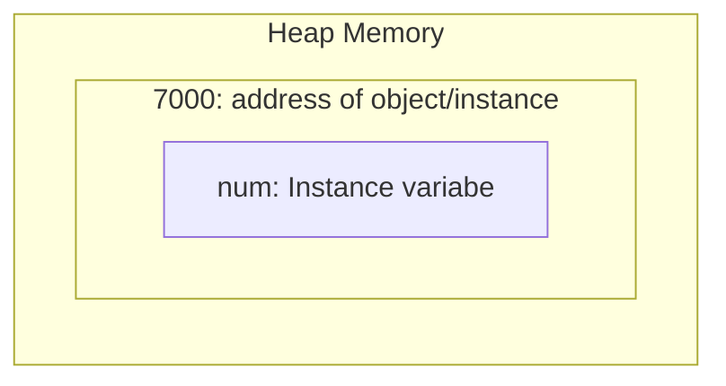
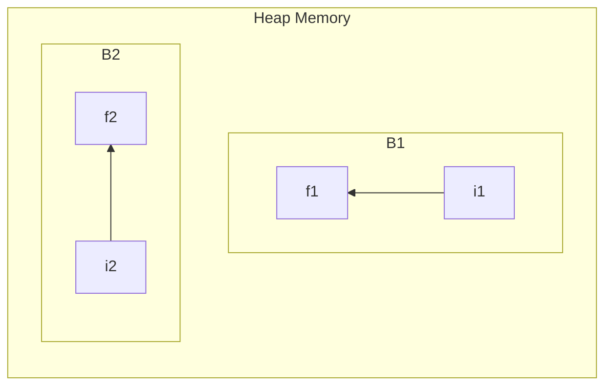

# Basics of Java

Java was owned by Sun Microsystem then this was tookover by Oraacle

---
**Need to learn Java**
1. Most technologies (~90%) are java based technologies
    - E-Com Technologies (Amazon, Flipkart)
    - Payment Gateways
    - Mobile Application development
---   

**Features of java**
- Java is Object-Oriented Technology. 
- Java is both compiled and interpreted.
- Java is platform independent language.
- After compilation of java we get *.class* file
- Java is Architecturally neutral language
- Java follows Data Encapsulation

What is platform dependent?
If we compile the program in windows and we get .exe file as output. And if this .exe file is executed in linux then it will not work.

---
**Installation and SetUp of Java Development Kit (JDK)**

JDK-17 is more stable than JDK-21 so we will install JDK-17. Follow thie steps given below:
1. Visit: [oracle.com](https://www.oracle.com/java/technologies/downloads/#jdk17-windows)
2. Select JDK-17 --> Windows
3. Click on x64 installer (Downloading will start).
4. Open downloaded file read instructions carefully and click next and install Java.
5. To verify installation: 
    - open command prompt and write:
        ```
        > cd C:\Program Files\Java\jdk-17\bin
        > javac.exe
        ```
        You should see many instruction, it means it is sucessfully installed
6. To make javac (java compiler) as environmental variable:
    - Go to environmental variables -> system varibale section -> create new
    - Path name: PATH , path value: C:\Program Files\Java (as per your bin folder location)
    - click ok and check again (same as step 4 but change the directory to C or D drive)

## First Program
- Class name always starts with Capital .
- Java is Case sensitive language.
- File name and class name should be same.

    HelloWorld.java (this is source file which should be saved with *.java* extension)
    ```java
    class HelloWorld{
        public static void main(String[] args){
            System.out.println("Hello World!");
        }
    }
    ```
To RUN this program
1. Save the file with name *HelloWorld.java*
2. open terminal:
    - To compile the file
        ```
        javac HelloWorld.java
        ```
        This command will create *HelloWorld.class*, this *.class* file is bytecode file.

    - To run file (To interpret).
        ```
        java HelloWorld
        ```
```java
class Sample{
        public static void main(String[] args){
            int a; // declaration
            int b = 1; //declaration with initialization
            a = 10;
            System.out.println("a= "+a); // we write " + " for concatinating the value of a
        }
    }
```
## Data-types in java
Data types are used to specify the compiler that the programmer is using such sort of data.

Java is designed for various and multiple use cases that's why it has more data types (having 8 primitive datatype) as compared to other languages like C-programming (having 3 primitive datatype)


### Primitive
Primitive datatypes are divided into 8 families.


#### A. Integral Datatype
1. **byte**
    - Size: 1 byte (8 bits)
    - Range: -128 to 127
    - Stores: Whole Numbers.
    - Example:
        ```java
        class ExampleByte{
            public static void main(String args[]){
                byte b = 13;
                System.out.println(" b = "+b);
            }
        }
        ```
2. **short**
    - Size: 2 byte (16 bits)
    - Range: -32,768 to 32,767
    - Stores: Whole Numbers.
    - Example:
        ```java
        class ExampleShort{
            public static void main(String args[]){
                short s = 32767;
                System.out.println(" s = "+s);
            }
        }
        ```
3. **int**
    - Size: 4 byte (32 bits)
    - Range: -2,147,483,648 to 2,147,483,647
    - Stores: Whole Numbers.
    - Note: it is a **Default datatype**.
    - Example:
        ```java
        class ExampleInt{
            public static void main(String args[]){
                int i = 12345;
                System.out.println(" i = "+i);
            }
        }
        ```
4. **long**
    - Size: 8 byte (64 bits)
    - Range: -9,223,372,036,854,775,808 to 9,223,372,036,854,775,8071
    - Stores: Whole Numbers.
    - Example:
        ```java
        class ExampleLong{
            public static void main(String args[]){
                long lg = 37652421465L;
                System.out.println(" lg = "+lg);
            }
        }
        ```

#### B. floating point Datatype

5. **float**
    - Size: 4 byte (32 bits)
    - Range: Sufficient for storing 6 to 7 decimal digits
    - Stores: fractional numbers.
    - Example:
        ```java
        class FloatExample{
            public static void main(String args[]){
                float pi = 3.14f;
                System.out.println(" PI = "+pi);
            }
        }
        ```
6. **double**
    - Size: 8 byte (64 bits)
    - Range: Sufficient for storing 15 decimal digits.
    - Stores: fractional numbers.
    - Example:
        ```java
        class DoubleExample{
            public static void main(String args[]){
                double do = 500000.34;
                System.out.println(" do = "+do);
            }
        }
       ```

#### C. Unicode
7. **char**
    - Size: 2 bytes (16 bits)
    - Range: Not defined.
    - Stores: single character/letter or ASCII values.
    - Example:
        ```java
        class CharExample{
            public static void main(String args[]){
                char ch = 'A';
                System.out.println(" ch = "+ch);
            }
        }
        ```
8. **boolean**
    - Size: 1 bit
    - Range: Not defined.
    - Stores: true or false values.
    - Note: Cannot typecast.
    - Example:
        ```java
        class BooleanExample{
            public static void main(String args[]){
                boolean bo = true;
                System.out.println(" b0 = "+bo);
                boolean bo1 = !bo;
                System.out.println(" bo1 = "+bo1);
            }
        }
        ```
### Derived Datatype
Non-primitive data types are called reference types because they refer to objects.

The main difference between primitive and non-primitive data types are:

- Primitive types are predefined (already defined) in Java. Non-primitive types are created by the programmer and is not defined by Java (except for String).
- Non-primitive types can be used to call methods to perform certain operations, while primitive types cannot.
A primitive type has always a value, while non-primitive types can be null.
- A primitive type starts with a lowercase letter, while non-primitive types starts with an uppercase letter.


1. **String**
    - String is a predefined class in Java which is immutable.
    - A String variable contains a collection of characters surrounded by double quotes.

    **Functions:** 
    - `length()`:
        - Gives Length of the string argument.
        - Return type is *int*.
    - `indexOf()`:
        - Gives the index of the first occurence of passed alphabet.
        - Return type is *int*.
    - `lastIndexOf()`:
        - Gives the index of last occurence of the passed alphabet.
        - Return type is *int*.
    - `charAt()`:
        - Gives the first occurence of character at hte passed index value.
        - Return type *char*

    - Example:
        ```java
        class StringExample{
            public static void main(String args[]){
                String city = "Number";
                System.out.println(" City = "+city);

                // length() function
                int len = city.length();
                System.out.println("Length of City is = "+len);

                // indexOf() function
                int index1 = city.indexOf('g');
                System.out.println("Index of 'g' is = "+index1);

                // lastIndexOf() function
                int index2 = city.lastIndexOf('g');
                System.out.println("Index of 'g' is = "+index2);

                //charAt() function
                char ch = city.charAt(6);
                System.out.println("Character at index is = "+ch);

            }
        }
        ```

Q. Write a Program to find number of occurences of a character in a given string.
```java
class Occurence{
    public static void main(String args[]){
        String str = "amravati";
        int len = str.length();
        int count = 0;
        for(int i = 0; i < len; i++){
            if(str.charAt(i) == 'a'){
                count++;
            }
        }
        System.out.println("Number of 'a' in string is = "+count);
    }
}

// Output: Number of 'a' in string is = 3
``` 
(03/02/2024)
## Installation of Eclipse IDE
1. Visit [here](https://www.eclipse.org/downloads/download.php?file=/oomph/epp/2023-12/R/eclipse-inst-jre-win64.exe), and download the IDE.
2. After installation open the downloaded `eclipse-inst-jre-win64.exe` file and select *Eclipse IDE for Java Developers*
3. Locate JAVA 17+VM , and from drop down select *JRE 17.0.10* and click install (This may take time because it downloads dependencies from the internet)
4. After installation you can *Launch*
5. Select a directory as workspace and Launch
6. Goto File -> New -> Java Project , give project nae and create
7. Remove the file from src (it creates error)
8. right click and create class, here you can start.

Sample code:
```java
//Print Table of two
public class tableOfTwo {
	public static void main(String[] args) {
		int key = 5;
		int result;
		for(int index = 0; index <= 10; index++) {
			result = key * index;
			System.out.println(key+" * "+index+" = "+result);
		}
	}
}
```
```java
// Print logical series: 5 8 10 16 15 24 20 32... 
public class LogicSeries {
	public static void main(String[] args) {
		int num1 = 5, num2 = 8;
		int result1, result2;
		for(int index = 1; index <= 10; index++) {
			result1 = num1*index;
			result2 = num2*index;
			System.out.print(result1+" "+result2+" ");
		}
	}
}
```
```java
// Fibonacci series
public class fibonacci {
	public static void main(String[] args) {
		int num1 = 0, num2 = 1;
		for(int index = 0; index<= 10; index++) {
			System.out.print(num1+" ");
			int temp = num1;
			num1 = num2;
			num2 = temp + num2;
		}
	}
}
```
more sample codes are written in Eclipse IDE and stored in : *Eclipse\My_First_Project\src*

(19-02-2024)

Pattern Printing 
1. Triangular Pyramid: 
    - It is implemented with nested for loop.
    - Outer loop is used for iteration of rows
    - Inner loop is for iteration of coloumns

## Object Oriented Programming in Java
| Procedural (C language)| Object oriented (Java) |
| -----------|-----------------|
|Time consuming application development|Rapid application develoment|
|Low execution time (Advantage)| High execution time (Disadvantage) |
|C is middle level language it can be converted easily to machine language|Java is high level language so it is time consuming to convert it to machine language|

Class and object:

**Java objects are always created inside the HEAP MEMORY**
```java
public class A {
	int num; // Instance variable
	
	public static void main(String[] args) {
		A a1 = new A(); // Object/Instance
	}
}
```
- Every instance has its own copy of variable. Here num is the variable of that particular instance so num is instance variable


